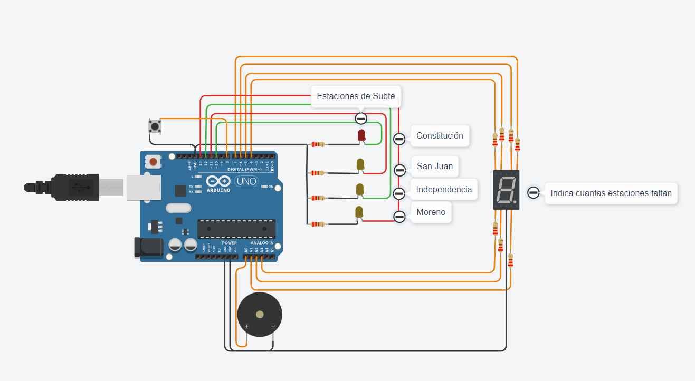

# Trabajo de SPD: Estaciones

## Proyecto: Estaciones de subte



## Descripcion

El proyecto conecta un botón, 4 luces led, un display de 7 segmento y un piezo para formar 4 estaciones de subte, cada led tiene el nombre su estacion a la derecha y el display indica cuanto falta para llegar a la estación final (Constitucion) representada por un led rojo, el resto de estaciones tienen leds amarillas y cada vez que se llega a una estacion suena el piezo. Todo comenzará cuando se pulse el botón

## Codigo

La funcion se encarga de encender los leds, sonar el piezo a una frecuencia determinada e indicar cuanto falta para la estacion final a traves del display, todo al mismo tiempo y durante las 4 estaciones. Esto solo se ejecutará luego de presionar el botón. Al mismo tiempo se encarga de dejar mensajes para que el usuario sepa en que estacion está o a cual se dirige

### Funcion principal

La funcion "estaciones" inicia solo si el digitalRead del botón es 0, es decir cuando se pulse el botón. Esto inicia el código con  la llegada a "Moreno" en la cual se mostrará un mensaje y luego se encenderá el display con el numero 3 y sonará el piezo indicando que llegó a la estacion, luego se apagará el display y el led y esperará 5 segundos (simulando un viaje) mostrando cual es la siguiente estacion por consola. 
Esto sucederá otras 3 veces pero el numero del display se irá reduciendo hasta llegar a cero y el piezo tendrá sonidos de distinta frecuencia en cada estación. Luego de llegar a Constitucion volverá de vuelta a Moreno.

#### Loop y funcion estaciones

```C++
void loop()
{
  int lectura = digitalRead(pulsador);
  if (lectura == 0)
  {
  	estaciones();
  }
} 

void estaciones()
{
  estacionMoreno();
  Serial.println(", Proxima estacion: Independencia");
  delay(5000);
  estacionIndependencia();
  Serial.println("Proxima estacion: San Juan");
  delay(5000);
  estacionSanJuan();
  Serial.println("Proxima estacion: Constitucion");
  delay(5000);
  estacionConstitucion();
  Serial.println("Proxima estacion: San Juan");
  delay(5000);
  estacionSanJuan();
  Serial.println("Proxima estacion: Independencia");
  delay(5000);
  estacionIndependencia();
  Serial.println("Proxima estacion: Moreno");
  delay(5000);
  estacionMoreno();
}
```

#### Ejemplo de una estacion

```C++
void estacionMoreno()
{
  Serial.println("Usted esta en la estacion: Moreno");
  digitalWrite(A, 1);
  digitalWrite(B, 1);
  digitalWrite(C, 1);
  digitalWrite(D, 1);
  digitalWrite(G, 1);
  digitalWrite(Moreno, 1);
  tone(piezo,1500,500); //PIEZO
  delay(5000);
    
  digitalWrite(A, 0);
  digitalWrite(B, 0);
  digitalWrite(C, 0);
  digitalWrite(D, 0);
  digitalWrite(G, 0);
  digitalWrite(Moreno, 0);
  delay(1000);
  Serial.print("Saliendo de Moreno");

}
```

## Link al proyecto

[tinkercard.com](https://www.tinkercad.com/things/5vcOcCOViFm-proyectospd2/editel?sharecode=ezKy-Gj_HaXjGMUgHvVlT-GJep9lFgq2OqNDjspLViE)

## Fuentes

[Tutorial de Git](https://www.youtube.com/watch?v=oxaH9CFpeEE)

[Consigna](https://docs.google.com/document/d/1QUrNz4aSNclbVyzF3rY5Ou-MX76enlGj5Y95jY3h6KY/edit?pli=1)